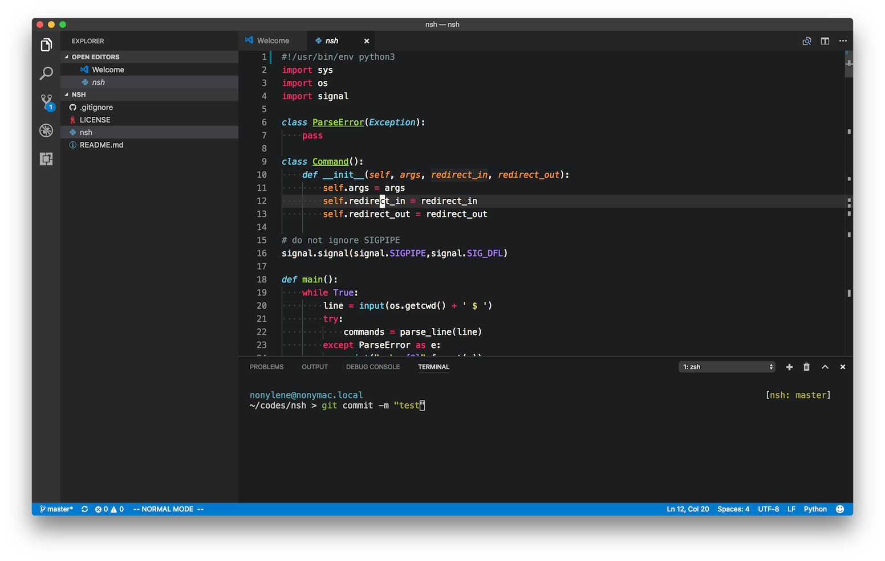

# Molokai theme for VSCode

This theme is inspired by [VSCode default dark theme, monokai theme](https://github.com/Microsoft/vscode) and [Vim Molokai theme](https://github.com/tomasr/molokai) .

[Repository](https://github.com/nonylene/vscode-dark-molokai-theme)



## Install

Please see [Marketplace](https://marketplace.visualstudio.com/items?itemName=nonylene.dark-molokai-theme).

## Development

### Debug

- Open this project by vscode
- Press F5 to run extension
- Change theme to `Dark (Molokai)`

### Publish

Doc: <https://code.visualstudio.com/api/working-with-extensions/publishing-extension>

- Increment version on `package.json`
- Add changelog to `CHANGELOG.md`
- Publish with `vsce` command

```console
$ vsce publish
```
