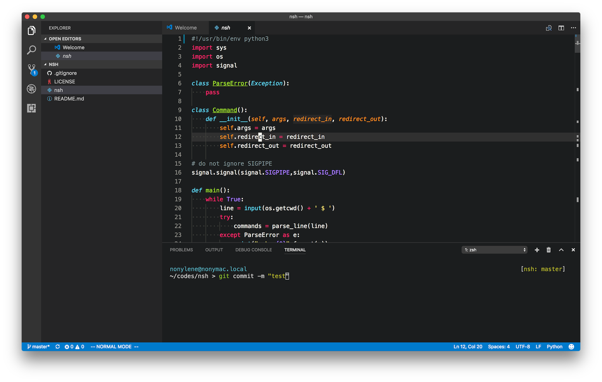

# Dark Molokai Theme for VSCode

This theme is inspired by [VSCode default dark theme, monokai theme](https://github.com/Microsoft/vscode) and [Vim Molokai theme](https://github.com/tomasr/molokai) .

[Repository](https://github.com/nonylene/vscode-dark-molokai-theme)

## Install

Please see [VSCode Marketplace](https://marketplace.visualstudio.com/items?itemName=nonylene.dark-molokai-theme) or [Open VSX Registry](https://open-vsx.org/extension/nonylene/dark-molokai-theme).

## Development

### Debug

- Open this project in vscode
- Press F5 to run extension
- Change theme to `Dark (Molokai)`

Tip: `Add Folder to Workspace...` to debug with existing projects

### Publish

- Update commit hashes that points origin sources in comments
- Increment version on `package.json`
- Add changelog to `CHANGELOG.md`
- Publish with `vsce` command
- `$ git tag vX.X.X` and push to this repository, then GitHub actions will publish to VS marketplace and OpenVSX.
